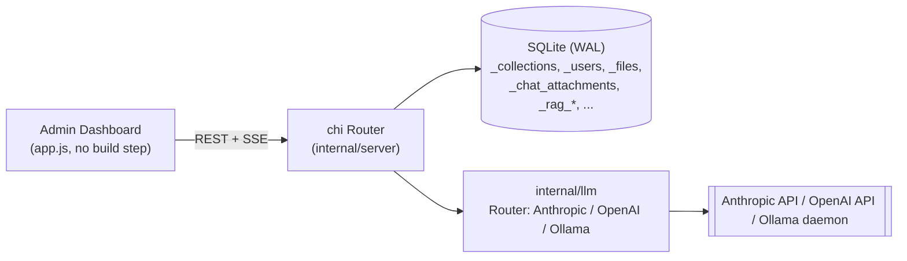
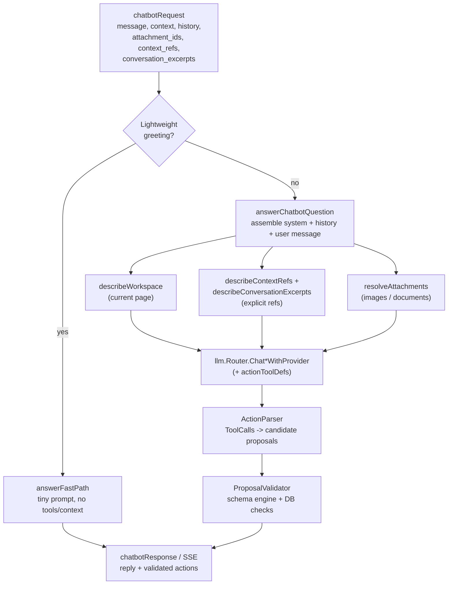
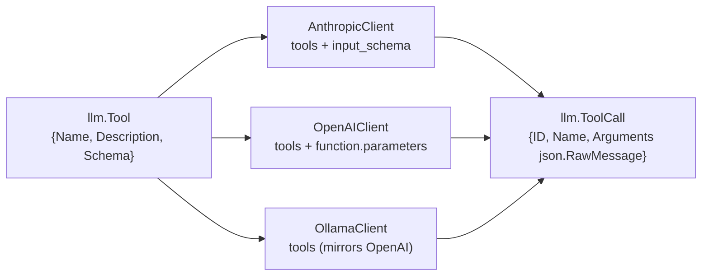
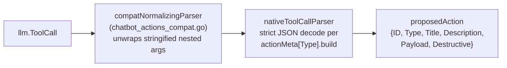
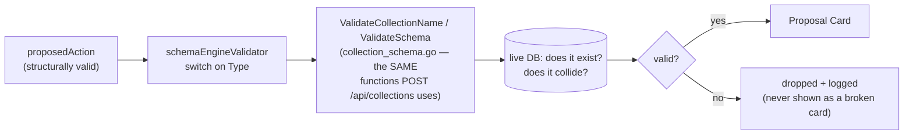
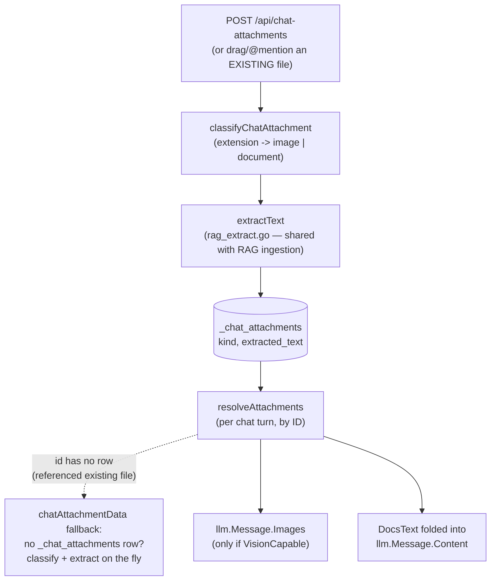
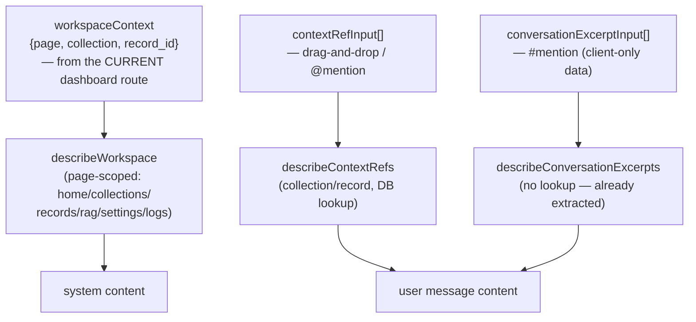
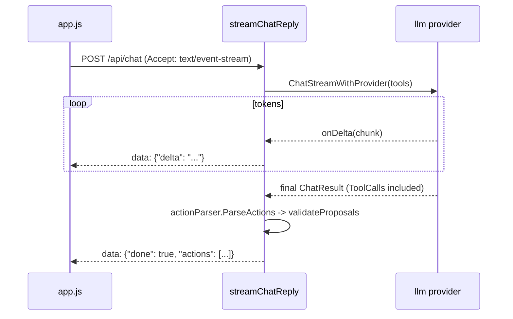
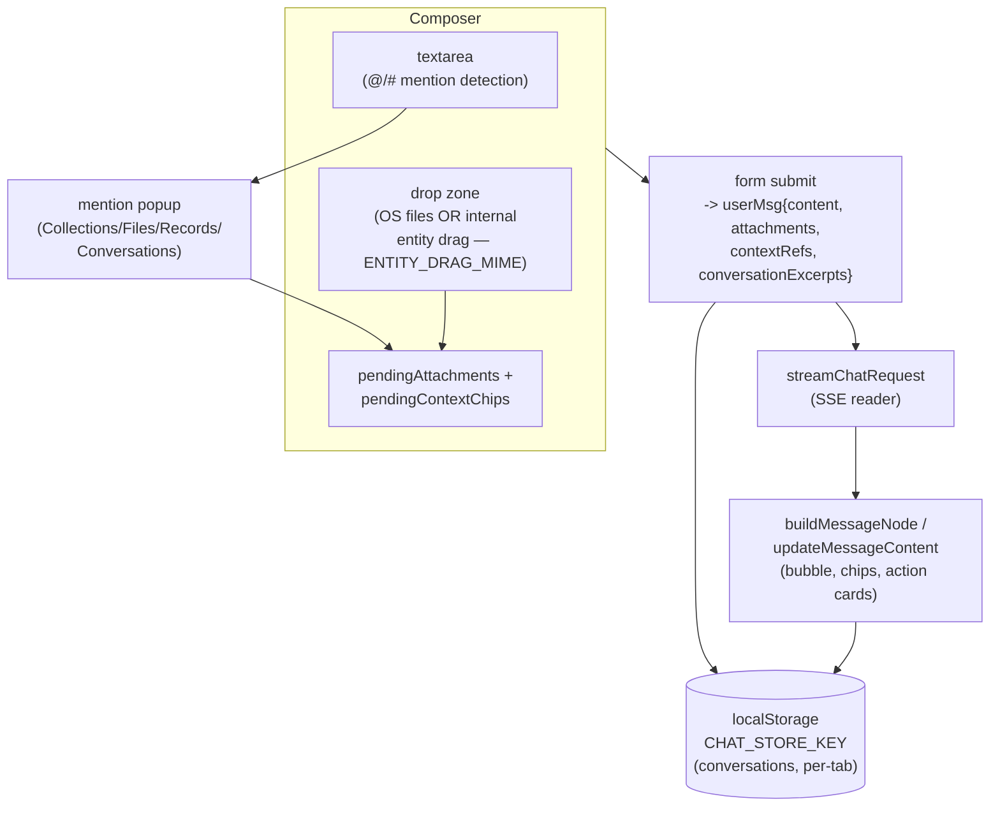
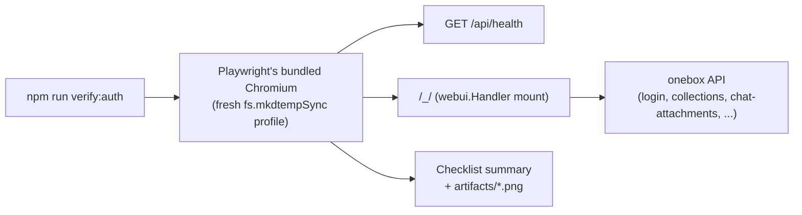

# onebox Architecture

This document describes how onebox's AI chat system is built: the request
pipeline from a chat message to a streamed reply, tool/function calling,
structured proposals, validation, attachments, and workspace context. It
covers the AI subsystem in depth and the rest of the backend briefly, since
that's where almost all the architectural complexity lives.

Audience: anyone extending the chatbot, adding a provider, or adding a new
kind of proposal/context reference.

## 1. Overall architecture

onebox is a single Go binary: an HTTP API (chi router), SQLite (via the
pure-Go `modernc.org/sqlite` driver, no cgo), and a dependency-free
JS/HTML/CSS admin dashboard served via `go:embed` — no frontend build step.

| Package | Responsibility |
|---|---|
| `internal/server` | HTTP handlers, chat pipeline, collections/records/files/RAG, auth |
| `internal/llm` | Provider-agnostic chat gateway: `Message`, `Tool`, `ChatResult`, per-provider clients |
| `internal/db` | SQLite connection (DSN-embedded pragmas — see §9) + migrations |
| `internal/auth` | JWT issue/parse, password hashing |
| `internal/embeddings` | Embedding provider adapters for RAG |
| `internal/webui` | `go:embed` of `static/{app.js,style.css,index.html}` |

Every dynamic collection is a real SQLite table (`CREATE TABLE` per
collection); `_collections` is the schema registry. This matters for the AI
pipeline because collection/record context is always read live from these
tables, never cached or duplicated.

## 2. AI pipeline (end to end)

One HTTP request, `POST /api/chat` (admin) or `POST /api/chat/{token}`
(public share link), produces one assistant turn through the same
`answerChatbotQuestion` orchestrator. The public path always passes an
empty `workspaceContext` and no attachments/context refs/history, and
uses a separate, more conservative `publicChatSystemPrompt` — but it is
still offered the same `actionToolDefs` as the admin path, so a public
visitor's reply can in principle still carry a validated proposal if the
model calls a tool anyway; only the prompt wording discourages it
(`TestPublicChatSystemPromptDoesNotProposeSchemas`), not a hard
server-side gate.

**Key file:** `internal/server/chatbot_handlers.go` — `answerChatbotQuestion`
is the orchestrator; every other pipeline below is a stage it calls into.

The fast path (`isLightweightGreeting`) skips workspace/context/tool
assembly entirely for a bare "hi"/"thanks" — it has no tool defs, so it
never produces proposals. Everything else goes through the full path.

## 3. Tool-calling pipeline

Provider-agnostic function calling, added so the model emits **structured**
data instead of the backend inferring intent from prose.

- `internal/llm/llm.go` — `Tool`, `ToolCall`, `ChatRequest.Tools`,
  `ChatResult.ToolCalls`.
- `internal/llm/{anthropic,openai,ollama}.go` — each client translates
  `Tool` into that API's native shape and parses tool calls back out, for
  both the non-streaming and streaming (SSE/NDJSON) paths. Streamed tool
  calls arrive fragmented (Anthropic, OpenAI) or whole (Ollama) — each
  client reassembles them internally so `ToolCall.Arguments` is always a
  complete, valid JSON value by the time the caller sees it.
- `internal/llm/vision.go` — `VisionCapable(provider, model)`, a
  name-based heuristic gating whether image bytes are attached at all (see
  §6).

**Known wire quirk:** some local models served through Ollama re-encode a
tool call's nested array/object arguments as a JSON *string* instead of a
native value. This is compensated for one layer up, in the proposal
pipeline (§4), not in `internal/llm` — the provider layer always reports
exactly what the wire sent.

**Extension point:** adding a fourth provider means implementing
`llm.Provider` (`Chat`, `ChatStream`) including `Tools`/`ToolCalls`
translation — nothing above `internal/llm` needs to change.

## 4. Proposal pipeline

Turns a model's tool call into a "Proposal Card" the dashboard can render.
User-facing term is **Proposal** (never "Action"); internal Go/CSS names
kept as `action*`/`proposedAction` to avoid renaming churn — see the doc
comments in `chatbot_context.go` and `app.js` for the mapping.

- `internal/server/chatbot_actions.go` — `actionToolDefs` (the 7 tool
  schemas: create/delete/rename collection, add/delete field, import data,
  update schema), `actionMeta` (fixed title/destructive per type +
  description built from the payload), `ActionParser` interface,
  `nativeToolCallParser`.
- `internal/server/chatbot_actions_compat.go` — `compatNormalizingParser`,
  the **isolated, removable** compatibility shim for the Ollama
  stringified-argument quirk above. Removing it is one line
  (`actionParser = nativeToolCallParser{}`) plus deleting the file.
- `proposedAction` is defined in `chatbot_context.go` (next to
  `workspaceContext`, since both feed the same prompt-assembly stage).

**Reply/action independence (load-bearing invariant):** `Content` (the
chat bubble) and `ToolCalls` (the proposal) are two separate fields on the
same `ChatResult`. The description on a card is built *only* from the
tool call's own arguments, never from parsing the reply text — a model
that calls a tool with no accompanying text (common) is expected, not a
bug.

**Extension point:** a new proposal type is "add a schema + tool def to
`actionToolDefs`, a payload struct, and an `actionMeta` entry" — parsing
and rendering are generic over `Type`.

## 5. Validation pipeline

Mandatory checkpoint between a structurally-parsed proposal and it ever
reaching a response. Never trusts the model's own claims about legality.

- `internal/server/chatbot_proposal_validator.go` — `ProposalValidator`
  interface, `schemaEngineValidator` (the only implementation),
  `(*Server).validateProposals` (the loop every response path calls).
- Reuses `collection_schema.go`'s `ValidateCollectionName`/`ValidateSchema`
  and `collections.go`'s `getCollectionByName` — the *same* functions the
  real `POST /api/collections` / `PUT .../schema` endpoints use, so a
  proposal and a hand-typed API request are held to identical standards.
  `add_field` is validated by constructing the *resulting* schema
  (existing fields + the new one) and running it through `ValidateSchema`
  whole — no duplicated field-name/type-checking logic.

**Full pipeline, restated:**
`LLM → ToolCall → ActionParser → ProposalValidator → Validated Proposal →
Proposal Card → (future) Approval → (future) Execution`. Only the first
five stages exist today; the Approve control is permanently disabled
client-side.

## 6. Attachment pipeline

Images (vision) and documents (extracted text), reusing the RAG engine's
own text extractor rather than a second implementation.

- `internal/server/chat_attachments.go` — `chatAttachmentExtensions`
  allowlist, `classifyChatAttachment`, `_chat_attachments` CRUD.
- `internal/server/chatbot_attachment_handlers.go` — upload/delete HTTP
  handlers; extracts document text eagerly at upload time.
- `internal/server/chatbot_attachments.go` — `resolveAttachments` (the
  per-turn resolver) and `chatAttachmentData`, which lets an admin
  reference a file that was **never** uploaded through the chat-attachment
  endpoint (dragged out of the Files browser instead) by classifying and
  extracting on first reference instead of at upload time.
- Vision gating: `llm.VisionCapable(provider, model)` — an image is left
  out (with a note appended to the prompt) rather than risking the whole
  request being rejected by a non-vision model.
- History replay never resends full image bytes or document text — only a
  `[Attached: filename]` note (`describeHistoryAttachments`), the same cap
  discipline as `maxChatHistoryTurns`.

## 7. Workspace context pipeline

Two independent ways context reaches the model: implicit (whatever page
the admin is on) and explicit (deliberately attached).

- `internal/server/chatbot_context.go` — `workspaceContext`,
  `describeWorkspace`, and the shared renderers `describeCollectionHeadline`
  / `describeCollectionFields` / `describeRecordJSON` used by **both**
  the page-based and the explicit-ref paths (one implementation of "how a
  collection is described," not two kept in sync by hand).
- `internal/server/chatbot_context_refs.go` — `contextRefInput`
  (collection/record — resolved against the live DB, capped at
  `maxContextRefs`), `conversationExcerptInput` (a `#`-mentioned *other*
  conversation — conversations live only in the dashboard's own
  `localStorage`, so the backend never looks them up; the frontend has
  already extracted the excerpt text, capped at
  `maxConversationExcerptChars`).
- A referenced **file** doesn't get its own ref type — it rides the
  existing `AttachmentIDs` slice (see §6's fallback).

## 8. Streaming pipeline

The dashboard's chat widget always requests
`Accept: text/event-stream` — the non-streaming JSON path exists for other
API clients and as a same-request fallback if the connection can't be
flushed or the provider's own stream errors before any output.

- `internal/server/chatbot_handlers.go` — `streamChatReply` (success +
  "provider errored before any output → fall back to one non-streaming
  call" path) and `writeNonStreamingReply`. `streamDoneEvent{Done,
  Actions}` is the final event's shape; `Actions` is `omitempty` so a
  plain-answer turn's payload stays `{"done":true}`.
- Tool-call argument fragments are **never** forwarded to `onDelta` — only
  text deltas are (see §3); actions only ever appear on the terminal
  event, once fully resolved and validated.

## 9. A note on SQLite concurrency

Not chat-specific, but load-bearing for anything that writes concurrently
(e.g. two attachments uploaded in one drag-drop): `internal/db/db.go`
encodes pragmas (`busy_timeout`, WAL, ...) **in the DSN**
(`_pragma=busy_timeout(5000)&...`), not via a one-time `Exec()` after
`sql.Open`. `database/sql`'s pool can open new physical connections on
demand; a `_pragma=` DSN param is applied by the driver to *every*
connection it opens, where a post-hoc `Exec()` only ever touched whichever
one connection happened to run it.

## 10. Frontend chat architecture

Single IIFE, `initChatbot()`, in `internal/webui/static/app.js` — built
once at load, never rebuilt per message or per navigation.

Key functions (all in `app.js`):
- **Composer/attachments** — `uploadAttachment`, `referenceExistingFile`
  (an existing file, no re-upload), `attachmentChipNode` /
  `attachmentImageTileNode` (real inline photo tiles, not just filename
  chips — see `openImageLightbox` for click-to-enlarge).
- **Context chips (M2)** — `pendingContextChips`, `addContextChip`,
  `contextChipNode`, `fetchCollectionPreview` / `fetchRecordPreview` (chip
  preview text — "display exactly what's being sent" — read from the
  *same* live endpoints the rest of the dashboard uses, so it can't drift
  from what the backend independently reconstructs).
- **Drag sources** — `makeEntityDraggable` (Collections/Records/Files list
  rows), `handleEntityDrop` (the chat panel's drop handler).
- **Mentions** — `fetchMentionCandidates`, `updateMentionState`,
  `renderMentionPopup`, `selectMentionItem` — `@` searches
  Collections/Files/Records (records scoped to whatever collection is
  currently open), `#` searches stored conversations client-side.
- **Send/stream** — `streamChatRequest` (resolves `{content, actions}`),
  `sendWithRetry`, `runTurn`.
- **Proposal Cards** — `renderActionCard` (the "Proposal" eyebrow +
  disabled "Waiting for approval" control), `renderActionCards`.
- **Conversations** — `loadConversations`/`saveConversations`
  (`localStorage`, versioned key), independent of any backend table.

## 11. Key extension points

| Want to... | Touch |
|---|---|
| Add a 4th LLM provider | Implement `llm.Provider` in `internal/llm/`; translate `Tool`/`ToolCall` |
| Add a new proposal type | `actionToolDefs` + payload struct + `actionMeta` entry in `chatbot_actions.go`; a validator case in `chatbot_proposal_validator.go` |
| Add a new page to workspace awareness | A `case` in `describeWorkspace` (`chatbot_context.go`) |
| Add a new `@mention` category | A branch in `fetchMentionCandidates` (app.js) + (if server-resolved) a `contextRefInput.Type` case in `describeContextRefs` |
| Add a compatibility shim for a model's wire quirk | A new `ActionParser` wrapper, same shape as `compatNormalizingParser` — swap `actionParser`'s initializer, nothing else changes |
| Wire up real execution | Add an endpoint the (currently disabled) Approve control POSTs `{ID, Type, Payload}` to, switch on `Type` — no response-shape change needed |

## 12. Files responsible for each subsystem

| Subsystem | Files |
|---|---|
| HTTP wiring / auth | `server.go`, `auth_handlers.go`, `unified_login.go` |
| Chat orchestration | `chatbot_handlers.go` |
| Tool-calling (provider-agnostic) | `internal/llm/llm.go`, `router.go` |
| Tool-calling (per provider) | `internal/llm/anthropic.go`, `openai.go`, `ollama.go`, `vision.go` |
| Proposal parsing | `chatbot_actions.go`, `chatbot_actions_compat.go` |
| Proposal validation | `chatbot_proposal_validator.go` |
| Attachments | `chat_attachments.go`, `chatbot_attachments.go`, `chatbot_attachment_handlers.go` |
| Workspace/context | `chatbot_context.go`, `chatbot_context_refs.go` |
| Capabilities (prompt facts) | `chatbot_capabilities.go` (derived from `collection_schema.go`'s own validation tables) |
| Schema engine (reused by validation) | `collection_schema.go`, `collections.go`, `records.go` |
| RAG (text extraction reused by attachments) | `rag_extract.go`, `rag_handlers.go` |
| SQLite connection | `internal/db/db.go`, `migrate.go` |
| Frontend chat widget | `internal/webui/static/app.js` (`initChatbot`), `style.css` |

## 13. Completed milestones

1. **AI Action Cards** — structured proposal response model, backend
   serialization, disabled-by-design frontend cards.
2. **Native tool-calling architecture** — replaced regex/prose detection
   with real `Tool`/`ToolCall` function calling across all three
   providers; `ActionParser` interface; `compatNormalizingParser` for a
   live Ollama wire quirk.
3. **Proposal validation** — `ProposalValidator`, reusing the schema
   engine; user-facing "Proposal" terminology; chatbot backend declared
   feature-complete/frozen barring bug reports.
4. **M1 — Multimodal chat** — drag-and-drop, paste, multi-file, image
   lightbox, PDF/DOCX/TXT/CSV/XLSX + vision across all three providers;
   found and fixed a real SQLite concurrency bug (§9).
5. **M2 — AI Workspace (context chips)** — drag collections/records/files
   into chat, `@`/`#` mention autocomplete, explicit `context_refs` +
   `conversation_excerpts`, live chip previews for transparency.

## 14. Planned milestones

- **AI Execution** — Approve → Execute a validated proposal, progress
  updates, result reporting, rollback/error handling. The entire pipeline
  in §4–§5 was explicitly designed for this: `Type` + `Payload` are
  already exactly what an executor needs.
- **AI Workspace, continued** — Memories, custom AI agents, MCP
  integration, a plugin/tool ecosystem (tool-calling's provider-agnostic
  `Tool` abstraction is the natural seam for MCP-sourced tools).

## 15. Browser verification workflow

**Policy: all browser-based UI verification of onebox uses
[`scripts/browser-verify`](scripts/browser-verify), never Claude's own
Chrome-automation tool, unless a human explicitly asks for that tool by
name for a specific one-off task.**

This policy exists because of a real incident: asking Claude to "verify in
Chrome" drives Claude's Chrome-automation feature, which — by design —
attaches to your actual installed Chrome browser (via an extension, inside
your existing session), not a disposable instance. That's a reasonable
default for general browsing tasks, but it is the wrong tool for repeated
local dev-loop UI checks, since it operates on the same browser you use for
everything else. `scripts/browser-verify` exists specifically to remove
that dependency for this project.

- **Isolation.** `chromium.launchPersistentContext()` on a fresh
  `fs.mkdtempSync` temp dir each run — a separate OS process and profile
  from any installed Chrome/Edge, with no extension bridge and no "reuse an
  existing session" step. Cleanup (`context.close()`) only ever closes the
  one process a given run launched; there is no `taskkill`/`pkill`/"close
  all Chrome" logic anywhere in the script.
- **Mount point.** The dashboard is served at `/_/` (see `server.go`'s
  `r.Mount("/_/", ...)` in §1), not at `/` — the script always navigates to
  `{base-url}/_/`.
- **Checklist** (`scripts/browser-verify/verify.mjs`), run in order, each
  item independently pass/fail/skip:

  | # | Check | What it does |
  |---|---|---|
  | 1 | Server reachable | `GET /api/health` before touching a browser at all |
  | 2 | Login works | fills the login form, waits for the dashboard shell |
  | 3 | Navigation works | clicks every `#mainNav` route, watches for errors |
  | 4 | Collections page | header + "+ New collection" control render |
  | 5 | Records page | opens an existing collection's records view (skips if none exist yet) |
  | 6 | Files page | "File Storage" header renders |
  | 7 | AI chat page | the `.chatbot-fab` opens the chat panel with a composer |
  | 8 | Attachments | uploads a throwaway file via `/api/chat-attachments`, confirms the chip renders, removes it |
  | 9 | Proposals | opt-in (`ONEBOX_VERIFY_PROPOSALS=1`) — sends a prompt likely to produce a Proposal Card (§4/§5) and clicks **Reject**; skipped by default since it depends on a live, configured LLM provider. A deterministic non-UI check of the same pipeline lives in `chatbot_proposal_validator_test.go`. Note the Approve control is permanently disabled client-side (§5), so this check can never mutate data either way. |
  | 10 | No console errors | fails on any uncaught page error or `console.error` (including the browser's own "failed to load resource" logging) |

- **Auth checks 3–9 require credentials**, read only from
  `ONEBOX_VERIFY_EMAIL` / `ONEBOX_VERIFY_PASSWORD` env vars (never a CLI
  flag) — use a throwaway/dev admin account, not a production one.
- **npm scripts:** `verify` (headless, unauthenticated smoke pass),
  `verify:headless` (explicit), `verify:auth` (full authenticated
  checklist, fails fast if credentials are missing), `verify:headed` (shows
  the browser window, for debugging the harness itself).

**Hardening notes — two real bugs this checklist has already caught, kept
here so a future edit doesn't silently reintroduce either:**

- Checks 4 and 6 (Collections/Files) read `.page-header-title`'s text via
  `waitForHeaderText()`, which polls until the text matches rather than
  reading once right after the element is merely present. `.page-header-
  title` exists on every page, so a one-shot read right after a route
  change can catch the *previous* page's still-attached header during the
  brief window before `navigate()`'s async render replaces it — this
  produced a real false failure ("Files page" reporting a stale
  collection-name header). Don't revert checks 4/6 to a plain
  `waitForSelector` + single read.
- Check 8 (Attachments) targets the composer's file input via
  `[data-testid="chat-attachment-input"]` (set in `app.js`), not a bare
  `input[type=file]` CSS match — the dashboard legitimately has several
  other file inputs (Files page, RAG sources, avatar upload, backup
  restore), and a type-only selector isn't guaranteed to resolve to
  exactly the chat composer's input. If a served build predates this
  `data-testid`, or a future change removes it, this check fails loudly
  rather than silently matching the wrong input — that's intentional; add
  the `data-testid` to whatever the new composer input is rather than
  loosening the selector.

See `scripts/browser-verify/README.md` for usage and the full safety
rationale.
