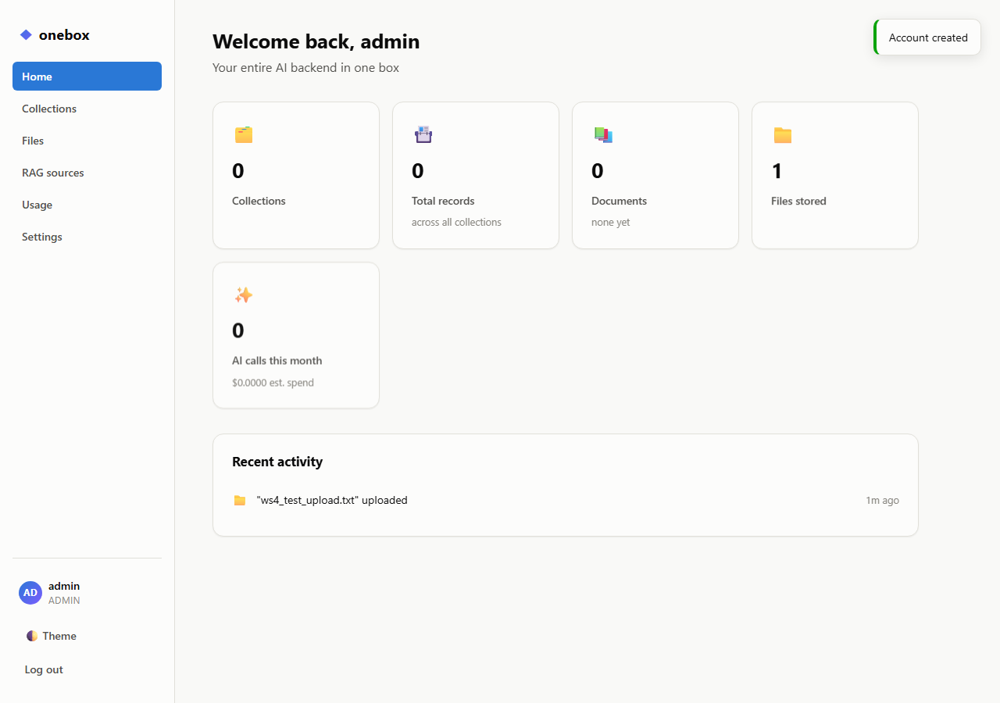
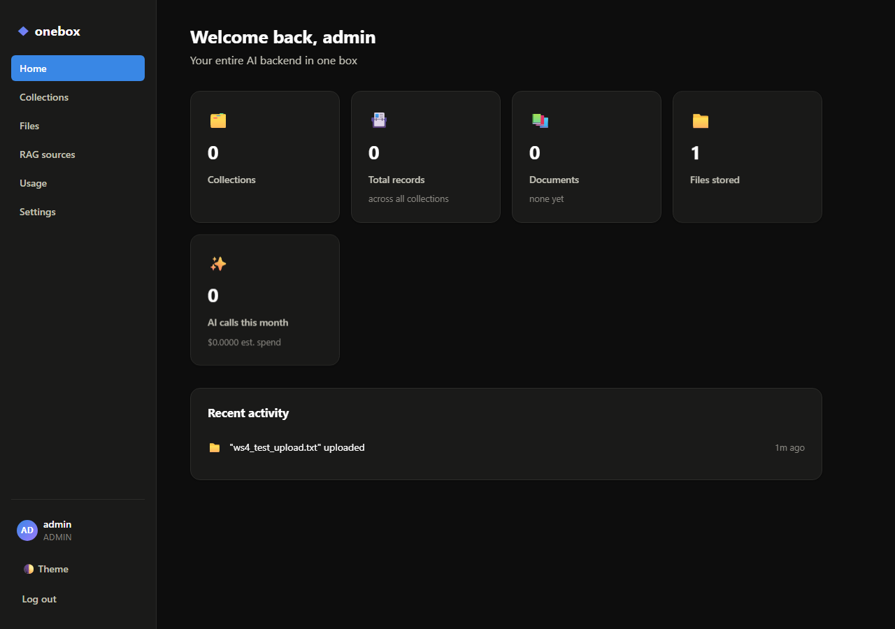
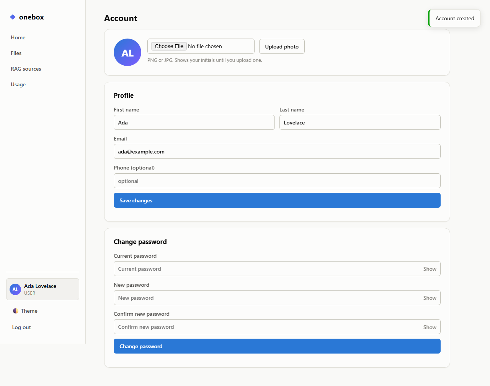
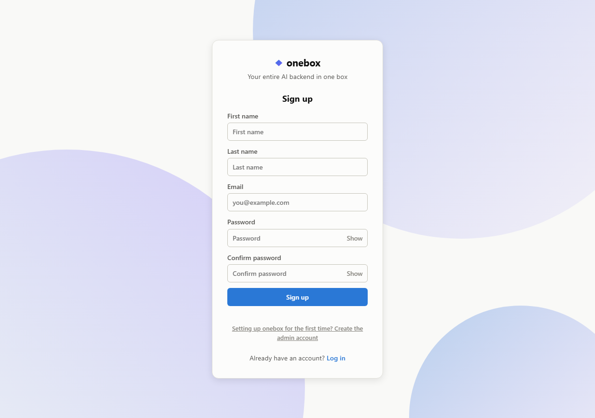
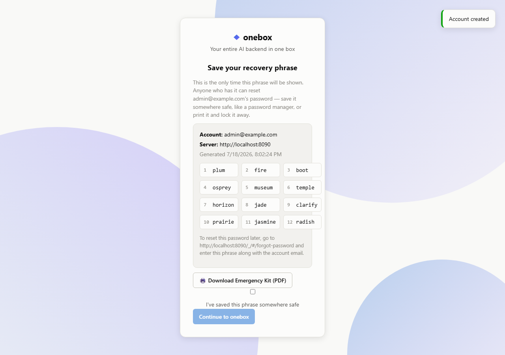
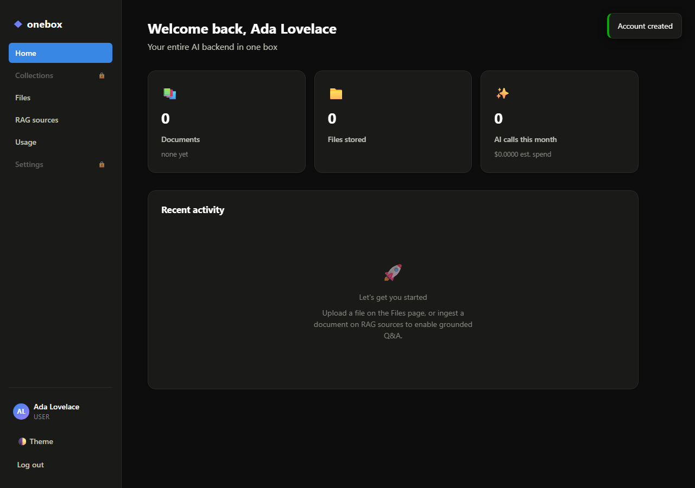
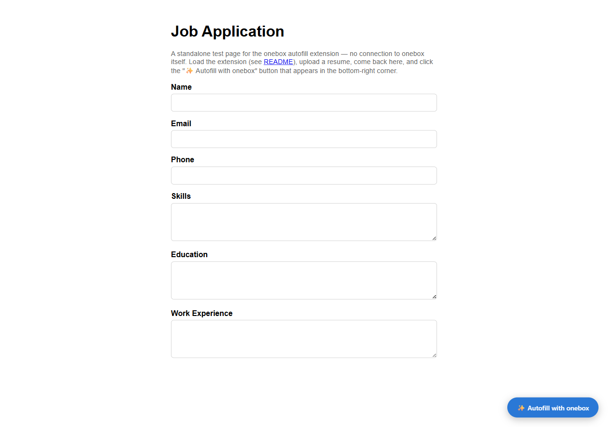
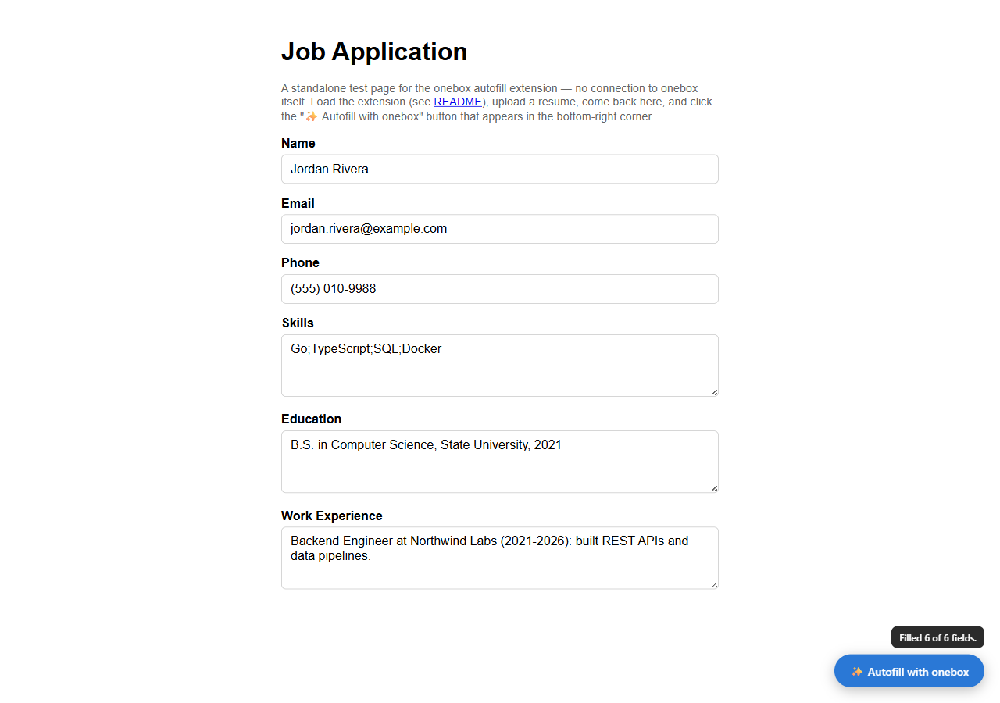

# onebox

**The All-in-One AI Backend — "PocketBase for AI Apps"**

One small binary: database, auth, files, vector search, RAG, and LLM gateway.

<!--
  TODO before launch: record a ~30s GIF/screenshot of the actual demo —
  download binary -> run -> bootstrap admin -> upload a PDF -> ask a
  question -> grounded answer with citations (see docs/quickstart.md,
  verified to run in under two minutes end-to-end). Drop it in
  docs/img/demo.gif and uncomment the line below.
-->
<!--  -->

## What it is

Download one file, run it, and you have a complete backend for an AI application:
data, users, file uploads, vector search, retrieval-augmented generation (RAG),
and a managed gateway to LLM providers.

Today, building an AI product means wiring together a database, a separate
vector store, an embeddings pipeline, auth, file storage, and LLM key
management. onebox collapses all of that into a single binary with a clean
admin dashboard.

## Screenshots

|  |  |
|---|---|
|  |  |
|  |  |
|  |  |

The [autofill extension example](examples/autofill-extension) filling a job
application from a resume ingested into onebox's RAG engine — a single
`✨ Autofill with onebox` click:

| Before | After |
|---|---|
|  |  |

## Quickstart

```bash
go build -o onebox ./cmd/onebox
./onebox
```

Then open `http://localhost:8090/_/` for the admin dashboard. See
[docs/quickstart.md](docs/quickstart.md) for the full two-minute walkthrough
(bootstrap admin → set provider keys → upload a PDF → get a grounded answer),
or [docs/tutorial-chat-with-your-docs.md](docs/tutorial-chat-with-your-docs.md)
for a from-scratch build of a small app on top of it.

## Status

All 6 months of the [roadmap](ROADMAP.md) are built: core server, auth,
dynamic collections, files, realtime, the RAG engine, the LLM gateway, an
admin dashboard, a JS/TS SDK, example apps, and release automation
(CI, cross-platform builds, a Dockerfile). Currently at v0.2.1 — see
[CHANGELOG.md](CHANGELOG.md) for the full history, including the dashboard
redesign (home page, account/profile, dedicated login/signup pages),
12-word recovery phrases, admin promote/demote, and DOCX ingestion.

## What's here

| | |
|---|---|
| [`cmd/onebox`](cmd/onebox) | The binary's entrypoint |
| [`internal/`](internal) | Server, auth, RAG, LLM gateway, config, embedded admin dashboard |
| [`sdk/js`](sdk/js) | Dependency-free JS/TS client SDK |
| [`docs/`](docs) | Quickstart, a full tutorial, the API reference, and [using onebox from any frontend](docs/compatibility.md) |
| [`examples/`](examples) | Four runnable demo apps built on the API |

## Example apps

Four small, runnable demos — each is just a regular client of the REST
API (or, for the last one, a browser extension calling it), not a
separate product with its own backend:

- [`examples/docs-qa`](examples/docs-qa) — the flagship demo: upload a
  document, ask a question, get a grounded answer with citations
- [`examples/notes-app`](examples/notes-app) — real signup/login,
  collections CRUD, and an LLM-gateway "summarize with AI" button
- [`examples/support-bot`](examples/support-bot) — RAG + the LLM gateway
  as a chat widget
- [`examples/autofill-extension`](examples/autofill-extension) — a
  Manifest V3 Chrome extension that fills web forms from a resume
  ingested into onebox's RAG engine: `/api/rag/sources` to ingest,
  `/api/rag/query` + `/api/llm/chat` (grounded in the retrieved resume
  text, asked for structured JSON) to extract field values on any page

## Scope (v0.1)

- **Core server** — single Go binary, HTTP server, config, migrations, admin dashboard
- **Data** — collections (tables) with typed fields, CRUD REST API, realtime subscriptions
- **Auth** — email/password, JWT sessions, per-collection access rules (public/authenticated/owner)
- **Files** — upload, store, serve files (local disk)
- **RAG engine** — ingest PDF/TXT/MD/DOCX, chunk, embed, brute-force cosine-similarity search (see [ROADMAP.md](ROADMAP.md) for why not sqlite-vec)
- **LLM gateway** — provider-agnostic `/api/llm/chat` (Anthropic, OpenAI, Ollama), streaming, caching, per-user rate/spend limits, usage logging

## Explicitly out of scope for v0.1

No custom storage engine, no clustering/replication, no Postgres/MySQL backend,
no custom model training, no GraphQL/gRPC, no plugin marketplace, no SSO/SAML.
SQLite + single node + REST/SSE only. See [ROADMAP.md](ROADMAP.md) for the full
anti-scope list and rationale.

## License

[MIT](LICENSE).
